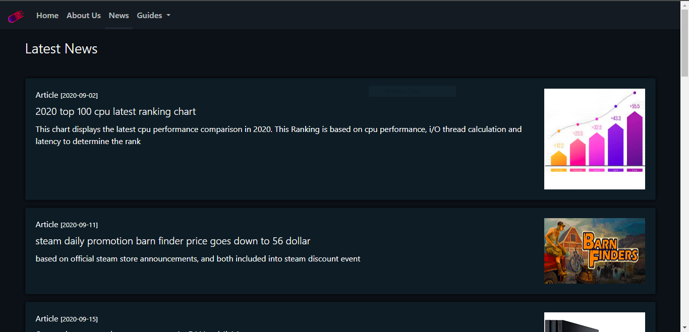
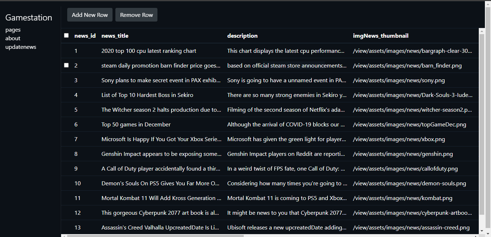

# Gamestation
A plain game news site designed from sratch. Get thing done without framework 
<br><br>

| news | database admin |
| --- | --- |
|  |  |

<br><br>
## Software Packages required 
1. php
2. php extension - pdo sqlite

## Enable PDO SQLite extension
1. Locate the php.ini file in the root directory of your PHP installation. This file controls various configuration options for PHP.
2. Open the php.ini file in a text editor.
3. Search for the line extension=pdo_sqlite. This line may be commented out with a semicolon at the beginning of the line, like this: `;extension=pdo_sqlite`.
4. Remove the semicolon at the beginning of the line to uncomment it, like this: `extension=pdo_sqlite`.
5. Save the php.ini file and close the text editor.

## Usage
1. Open a terminal and navigate to the root directory of the project
2. Run the command `php -S localhost:8000` to start the web server

This will start the app and make it available at http://localhost:8000 in your web browser.

## What is Inside ?
1. Home Page with carousel and weekly update table
2. About Page with gamestation photo and sample text
3. News Page with the list of new articles
4. Admin System with webeditor and etc...

## Docker
1. start the site listenning to 5000 web port and 2000 mysql port
```
$ docker run --name gstation -dit -e MYSQL_ROOT_PWD=hou -e MYSQL_USER=hou -e MYSQL_USER_PWD=hou -e MYSQL_USER_DB=gamestation -p 5000:80 -p 2000:3306 chunhou5741/gamestation 
```
2. restore database otherwise the site cannot initialize without data
```
$ docker exec -it gstation run.sh restore gamestation
```

## License
Gamestation is licensed under Creative Common license. user are able to use, share and build upon the work.
